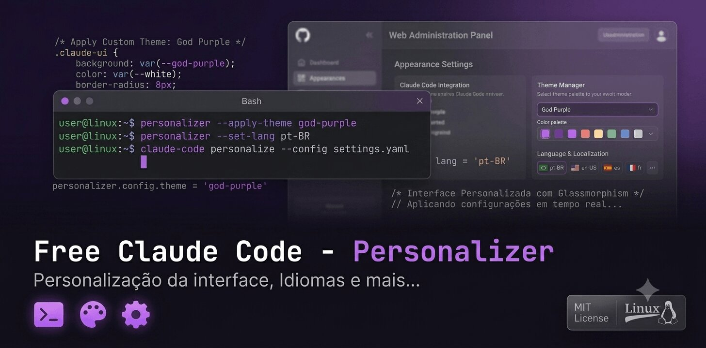
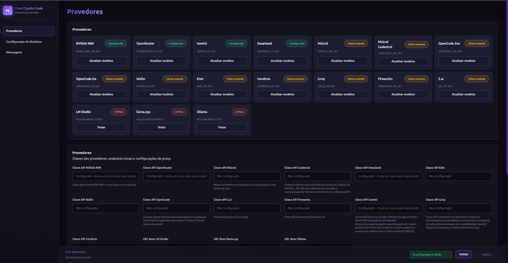

<p align="center">
   
</p>

<p align="center">
   [](https://github.com/Alishahryar1/free-claude-code)
   [](#-temas-disponíveis)
   [](https://github.com/godoyrw/free-claude-code-personalizer/stargazers)
   [](https://github.com/godoyrw/free-claude-code-personalizer/issues)
   [](https://github.com/godoyrw/free-claude-code-personalizer/commits/main)
   [](https://systemd.io/)
   [](https://systemd.io/)
</p>

# Free Claude Code - Personalizer

Este projeto permite personalizar a interface de administração do (<a href="https://github.com/Alishahryar1/free-claude-code" target="_blank">Free Claude Code</a>) com diferentes temas visuais, instalar o serviço systemd, adicionar aliases de comando e configurar um proxy para tradução dinâmica.

#### Versão: v1.0.0

---

## 📋 Visão Geral

O script `fcc-personalizer.sh` permite que você:

- Selecione entre diversos temas visuais para a interface admin
- Instale o serviço systemd **template** (`fcc@.service`) para gerenciamento automático do Free Claude Code (uma instância por usuário)
- Instale o serviço proxy (`fcc-proxy@.service`) para tradução dinâmica da interface
- Instale aliases de comando para facilitar o controle do serviço (`fcc-start`, `fcc-stop`, etc.)
- Verifique e reinicie instâncias existentes do serviço com segurança
- Desinstale tudo e restaure o tema padrão com a flag `--uninstall`

---

## 🧩 Componentes Principais

🟨 **fcc-personalizer.sh**
- Instala temas visuais
- Configura idiomas estáticos
- Configura systemd (serviços principal e proxy)
- Inicializa o serviço de proxy
- Gerencia aliases de comando

🐍 **fcc_proxy.py**
- Intercepta requisições HTTP entre o navegador e o runtime
- Aplica tradução dinâmica usando arquivos JSON em `lang/dynamic/locales/`
- Permite override de elementos da interface via middleware
- Carrega locales em tempo real sem necessidade de reinicialização

⚙️ **fcc@.service**
- Template do serviço systemd para o runtime principal do Free Claude Code
- Cria uma instância isolada por usuário (`fcc@$USER.service`)
- Configura auto-restart via systemd em caso de falha
- Gerencia o ciclo de vida do processo `fcc-server`

⚙️ **fcc-proxy@.service**
- Template do serviço systemd para o proxy de tradução
- Executa como middleware entre o navegador e o runtime principal
- Responsável por interceptar e modificar resposta HTTP para aplicar traduções
- Gerencia o ciclo de vida do processo de proxy

---

## 📁 Estrutura do Projeto

```
.
├── .gitignore                # Arquivos e pastas ignorados pelo Git
├── lang/                     # Arquivos de idioma (JavaScript) – versionados no repositório
│   ├── static/               # Idiomas estáticos
│   │   ├── default/          # Idioma padrão (inglês)
│   │   │   ├── admin.js
│   │   │   └── index.html
│   │   └── pt-br/            # Português do Brasil
│   │       ├── admin.js
│   │       └── index.html
│   ├── dynamic/              # Idiomas dinâmicos (locales)
│   │   ├── locales/
│   │   │   ├── config.json
│   │   │   ├── en.json
│   │   │   └── pt_BR.json
│   │   └── README.md
│   ├── fcc_proxy.py          # Script proxy para tradução dinâmica
│   └── fcc-proxy@.service    # Template de serviço systemd para o proxy
├── service/                  # Arquivos de serviço e aliases
│   ├── fcc@.service          # Template de serviço systemd
│   └── fcc.aliases.sh        # Aliases de comando para gerenciamento
├── themes/                   # Temas visuais (CSS)
│   ├── campbell/
│   ├── default/
│   ├── dracula/
│   ├── gnome/
│   ├── god-purple/
│   ├── high-contrast/
│   ├── horizon/
│   ├── linux/
│   ├── nord/
│   ├── solarized/
│   ├── tango/
│   ├── ubuntu/
│   ├── vs-code/
│   └── xterm/
├── fcc-personalizer.sh       # Script principal (instalação e desinstalação)
└── README.md                 # Este arquivo
```

Diagrama Mermaid da estrutura completa:

```mermaid
graph TD
    root[Root]
    root --> fcc[fcc-personalizer.sh]
    root --> lang[lang]
    lang --> static[static]
    static --> default[default]
    default --> admin_js[admin.js]
    default --> index_html[index.html]
    static --> pt_br[pt-br]
    pt_br --> admin_js_pt[admin.js]
    pt_br --> index_html_pt[index.html]
    lang --> dynamic[dynamic]
    dynamic --> locales[locales]
    locales --> config[config.json]
    locales --> en[en.json]
    locales --> pt_BR[pt_BR.json]
    dynamic --> readme_d[README.md]
    dynamic --> proxy_py[fcc_proxy.py]
    dynamic --> proxy_service["fcc-proxy@.service"]
    root --> readme[README.md]
    root --> service[service]
    service --> aliases[fcc.aliases.sh]
    service --> service_file["fcc@.service"]
    root --> themes[themes]
    themes --> campbell[campbell]
    campbell --> css_c[admin.css]
    themes --> default_t[default]
    default_t --> css_d[admin.css]
    themes --> dracula[dracula]
    dracula --> css_dr[admin.css]
    themes --> gnome[gnome]
    gnome --> css_g[admin.css]
    themes --> god_purple[god-purple]
    god_purple --> css_gp[admin.css]
    themes --> high_contrast[high-contrast]
    high_contrast --> css_hc[admin.css]
    themes --> horizon[horizon]
    horizon --> css_hz[admin.css]
    themes --> linux[linux]
    linux --> css_l[admin.css]
    themes --> nord[nord]
    nord --> css_n[admin.css]
    themes --> solarized[solarized]
    solarized --> css_s[admin.css]
    themes --> tango[tango]
    tango --> css_t[admin.css]
    themes --> ubuntu[ubuntu]
    ubuntu --> css_u[admin.css]
    themes --> vs_code[vs-code]
    vs_code --> css_vs[admin.css]
    themes --> xterm[xterm]
    xterm --> css_x[admin.css]
```



---

## 🚀 Como Usar

1. **Certifique-se de que o Free Claude Code está instalado** no seu sistema
2. **Clone o repositório:**

```bash
git clone https://github.com/godoyrw/free-claude-code-personalizer.git
cd free-claude-code-personalizer
```

3. **Torne o script executável (se necessário):**

```bash
chmod +x fcc-personalizer.sh
```

4. **Execute o script:**

```bash
./fcc-personalizer.sh
```

5. **Siga as instruções na tela:**
   - Selecione o tema desejado
   - Selecione o idioma desejado
   - O script instalará automaticamente o serviço systemd template, o serviço proxy e iniciará uma instância para o seu usuário
   - Os aliases serão adicionados ao `~/.bashrc` e carregados imediatamente na sessão atual
   - O status dos serviços será exibido ao final


### Acesso ao proxy administrativo e traduzido:

```bash
acesse : http://127.0.0.1:8083/admin
```
<p align="center">
   
</p>


> ⚠️ **Atenção:** O `DEST_DIR` no script está configurado para um caminho fixo. Antes de usar, verifique e ajuste a variável `DEST_DIR` no início do `fcc-personalizer.sh` para corresponder ao seu ambiente.

---

## 🎨 Temas Disponíveis

| Tema          | Descrição                                  |
| ------------- | ------------------------------------------ |
| campbell      | Tema inspirado no terminal do Windows      |
| default       | Tema padrão do Free Claude Code            |
| dracula       | Tema escuro com cores vibrantes            |
| gnome         | Tema inspirado no desktop GNOME            |
| god-purple    | Tema roxo escuro                           |
| high-contrast | Tema de alto contraste para acessibilidade |
| horizon       | Tema com cores suaves e agradáveis         |
| linux         | Tema inspirado no terminal Linux           |
| nord          | Tema com paleta de cores frias             |
| solarized     | Tema com cores suaves para longas sessões  |
| tango         | Tema inspirado na paleta Tango             |
| ubuntu        | Tema inspirado no Ubuntu                   |
| vs-code       | Tema inspirado no Visual Studio Code       |
| xterm         | Tabela clássico do terminal XTerm          |

| Idioma | Pasta | Status |
|----------|----------|----------|
| Inglês (padrão) | `lang/static/default/` | ✅ Completo |
| Português do Brasil | `lang/static/pt-br/` | ✅ Completo |

O sistema de seleção de idioma está integrado ao script, permitindo escolher entre os idiomas disponíveis em `lang/static/`.

---

## ⚙️ Serviços Systemd

O script instala automaticamente dois templates systemd:

### 1. Serviço Principal (`fcc@.service`)

- Copia `fcc@.service` para `/etc/systemd/system/`
- Recarrega o daemon do systemd
- Para e desabilita qualquer instância anterior com segurança
- Habilita e inicia uma nova instância para o usuário atual (`fcc@$USER`)
- Valida se o serviço está ativo após a instalação e exibe logs em caso de falha

Após instalado, gerencie o serviço com (substitua `<user>` pelo seu nome de usuário):

```bash
sudo systemctl start   fcc@<user>.service   # Iniciar
sudo systemctl stop    fcc@<user>.service   # Parar
sudo systemctl restart fcc@<user>.service   # Reiniciar
sudo systemctl status  fcc@<user>.service   # Ver status
journalctl -u fcc@<user> -f                 # Acompanhar logs em tempo real
```

### 2. Serviço Proxy (`fcc-proxy@.service`)

- Copia `fcc-proxy@.service` para `/etc/systemd/system/`
- Recarrega o daemon do systemd
- Para e desabilita qualquer instância anterior com segurança
- Habilita e inicia uma nova instância para o usuário atual (`fcc-proxy@$USER`)
- Valida se o serviço está ativo após a instalação e exibe logs em caso de falha


```bash
sudo systemctl start   fcc-proxy@<user>.service   # Iniciar
sudo systemctl stop    fcc-proxy@<user>.service   # Parar
sudo systemctl restart fcc-proxy@<user>.service   # Reiniciar
sudo systemctl status  fcc-proxy@<user>.service   # Ver status
journalctl -u fcc-proxy@<user> -f                 # Acompanhar logs em tempo real
```

> **Acesso à interface administrativa traduzida:** Após a instalação do proxy, a interface administrativa do Free Claude Code com tradução dinâmica estará disponível em: **http://127.0.0.1:8083/admin**

---

## 🔧 Aliases de Comando

O script adiciona os seguintes aliases ao `~/.bashrc` (e opcionalmente em `/etc/bash.bashrc.d/fcc-aliases` para disponibilidade system-wide):

| Alias | Ação |
|---|---|
| `fcc-start` | Inicia o serviço Free Claude Code |
| `fcc-stop` | Para o serviço Free Claude Code |
| `fcc-restart` | Reinicia o serviço Free Claude Code |
| `fcc-status` | Mostra o status do serviço |
| `fcc-logs` | Visualiza os logs em tempo real |

Os aliases ficam disponíveis imediatamente na sessão atual após a instalação. Em novas sessões de terminal, são carregados automaticamente via `~/.bashrc`. Se necessário, carregue manualmente:

```bash
source ~/.bashrc
```

Se já existirem aliases do FCC no `~/.bashrc`, o script os remove antes de reinstalar.

---

## 📄 Licença

Este projeto está licenciado sob a **MIT License**.

---

## 👤 Autor

Desenvolvido por [Roberto Godoy](https://github.com/godoyrw)
[](https://orcid.org/0009-0003-2100-4772)

##### Versão: v1.0.0
---