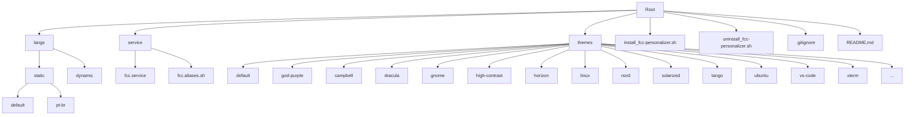

# Free Cloud Code - Personalizer

Este projeto permite personalizar a interface de administração do Free Claude Code com diferentes temas, idiomas, instalar o serviço systemd e adicionar aliases de comando para facilitar o gerenciamento.

## 📋 Visão Geral

O instalador permite que você:
- Escolha entre vários idiomas disponíveis (incluindo português do Brasil)
- Selecione entre diversos temas visuais para a interface admin
- Instale facilmente o idioma e tema escolhidos na sua instalação do Free Claude Code
- Instale o serviço systemd para gerenciamento automático do Free Claude Code
- Instale aliases de comando para facilitar o controle do serviço (fcc-start, fcc-stop, etc.)
- Verifique se já existem aliases e escolha se deseja remover/reinstalar
- Veja o status do serviço após a instalação
- Reinicie o servidor após a instalação para aplicar as mudanças

## 📁 Estrutura do Projeto



## 🚀 Como Usar

1. **Certifique‑se de que o Free Claude Code está instalado** no seu sistema  
2. **Execute o script de instalação:**
   ```bash
   ./install_fcc-personalizer.sh
   ```
3. **Siga as instruções na tela:**
   - Selecione o idioma desejado  
   - Selecione o tema desejado  
   - O script verificará se já existem aliases e perguntará se deseja remover/reinstalar  
   - O script instalará automaticamente o serviço systemd e mostrará seu status  
   - O script instalará os aliases e os carregará imediatamente na sessão atual  
   - Confirme se deseja reiniciar o servidor Free Claude Code após a instalação  

Para desinstalar e restaurar as configurações padrão:
```bash
./uninstall_fcc-personalizer.sh
```
ou
```bash
./install_fcc-personalizer.sh --uninstall
```

## 🌐 Idiomas Disponíveis

- **default** – Inglês (padrão)  
- **pt-br** – Português do Brasil  

> ⚠️ A pasta `langs/` está listada no `.gitignore` para evitar que os arquivos de idioma sejam versionados acidentalmente. Eles ainda estão disponíveis no projeto para uso local.

## 🎨 Temas Disponíveis

O projeto inclui diversos temas visuais para personalizar a interface:

- `default` – Tema padrão do Free Claude Code  
- `god-purple` – Tema roxo e preto (destacado)  
- `campbell` – Tema baseado no esquema Campbell  
- `dracula` – Tema escuro popular Dracula  
- `gnome` – Tema inspirado no GNOME  
- `high-contrast` – Tema de alto contraste para acessibilidade  
- `horizon` – Tema com gradientes suaves  
- `linux` – Tema com cores do terminal Linux clássico  
- `nord` – Tema nórdico escuro  
- `solarized` – Tema Solarized (versão escura)  
- `tango` – Tema baseado no padrão Tango  
- `ubuntu` – Tema com cores da distribuição Ubuntu  
- `vs-code` – Tema inspirado no Visual Studio Code  
- `xterm` – Tema tradicional do terminal XTerm  
- … e muitos outros disponíveis em `themes/`

## ⚙️ Serviço Systemd

O instalador agora inclui a instalação automática do serviço systemd:

- Instala `fcc.service` em `/etc/systemd/system/`  
- Recarrega o daemon do systemd  
- Habilita o serviço para iniciar automaticamente no boot  
- Mostra o status do serviço após a instalação  
- Permite gerenciamento via `systemctl`:

```bash
sudo systemctl start fcc.service    # Iniciar o serviço
sudo systemctl stop fcc.service     # Parar o serviço
sudo systemctl restart fcc.service  # Reiniciar o serviço
sudo systemctl status fcc.service   # Ver status do serviço
```

## 🔧 Aliases de Comando

Além do serviço, o instalador adiciona aliases convenientes ao seu `~/.bashrc`:

- `fcc-start` – Inicia o serviço Free Claude Code  
- `fcc-stop` – Para o serviço Free Claude Code  
- `fcc-restart` – Reinicia o serviço Free Claude Code  
- `fcc-status` – Mostra o status do serviço Free Claude Code  
- `fcc-logs` – Visualiza os logs do serviço em tempo real  

O script agora:
- Verifica se já existem aliases do Free Claude Code em `~/.bashrc`  
- Pergunta se você deseja remover os existentes e reinstalá-los  
- Carrega os imediatamente na sessão atual com `source ~/.bashrc`  
- Permite que você use os aliases imediatamente após a instalação  

Esses aliases ficam disponíveis automaticamente em novas sessões de terminal ou podem ser carregados imediatamente com:
```bash
source ~/.bashrc
```

## 🛠️ Personalização Avançada

Se desejar criar seu próprio tema ou idioma:

### Para criar um novo tema:
1. Duplicar uma das pastas existentes em `themes/`  
2. Modificar o arquivo `admin.css` com suas variáveis CSS personalizadas  
3. O tema será automaticamente detectado pelo instalador  

### Para criar um novo idioma:
1. Duplicar uma das pastas existentes em `langs/static/`  
2. Modificar o arquivo `admin.js` traduzindo as strings para o seu idioma  
3. O idioma será automaticamente detectado pelo instalador  

## ⚙️ Como Funciona o Instalador

O script `install_fcc-personalizer.sh`:
1. Verifica se o Free Claude Code está instalado  
2. Apresenta uma lista de idiomas disponíveis para seleção  
3. Apresenta uma lista de temas disponíveis para seleção  
4. Copia os arquivos selecionados para o diretório de instalação do Free Claude Code  
5. Instala o serviço systemd (`fcc.service`) e o habilita  
6. Mostra o status do serviço após a instalação  
7. Verifica se já existem aliases do Free Claude Code em `~/.bashrc`  
8. Pergunta se deseja remover e reinstalá-los (se existirem)  
9. Instala os aliases de comando em `~/.bashrc`  
10. Carrega os imediatamente na sessão atual  
11. Cria um backup dos arquivos originais antes da substituição  
12. Opcionalmente reinicia o servidor Free Claude Code para aplicar as mudanças imediatamente  

## 📝 Notas

- Sempre é criado um backup automático dos arquivos originais antes da instalação  
- Os backups são nomeados com timestamp para fácil identificação  
- Se encontrar qualquer problema, você pode restaurar a partir dos backups criados  
- O script requer que o comando `fcc-server` esteja disponível no PATH  
- A instalação do serviço systemd requer privilégios `sudo`  
- Os aliases são adicionados ao `~/.bashrc` e ficam disponíveis em novas sessões  

## 💡 Dicas

- Experimente diferentes combinações de idioma e tema para encontrar sua preferida  
- O tema `god-purple` foi especialmente projetado para proporcionar uma experiência moderna com tons de roxo e preto  
- Após instalar o serviço, você pode gerenciá‑lo facilmente com os aliases (`fcc-start`, `fcc-stop`, etc.) ou comandos `systemctl`  
- Alterações só entram em efeito após reiniciar o servidor Free Claude Code  
- Se Executar o script de instalação várias vezes, ele detectará aliases existentes e perguntará o que fazer  
- O script de desinstalação restaura o tema e idioma padrão, remove o serviço e os aliases  

--- 

*Documentação mantida em português brasileiro conforme as diretrizes do projeto.*