# Free Claude Code - Personalizer

[](https://opensource.org/licenses/MIT)
[](https://www.gnu.org/software/bash/)
[](https://www.kernel.org/)
[](https://systemd.io/)
[](#-temas-disponíveis)
[](https://github.com/godoyrw/free-claude-code-personalizer/stargazers)
[](https://github.com/godoyrw/free-claude-code-personalizer/issues)
[](https://github.com/godoyrw/free-claude-code-personalizer/commits/main)


Este projeto permite personalizar a interface de administração do Free Claude Code com diferentes temas visuais, instalar o serviço systemd e adicionar aliases de comando para facilitar o gerenciamento.

## 📋 Visão Geral

O script `fcc-personalizer.sh` permite que você:

- Selecione entre diversos temas visuais para a interface admin
- Instale o serviço systemd **template** (`fcc@.service`) para gerenciamento automático do Free Claude Code (uma instância por usuário)
- Instale aliases de comando para facilitar o controle do serviço (`fcc-start`, `fcc-stop`, etc.)
- Verifique e reinicie instâncias existentes do serviço com segurança
- Desinstale tudo e restaure o tema padrão com a flag `--uninstall`

> **Nota sobre idiomas:** A seleção de idioma **ainda não está implementada** no script atual — somente temas são aplicados. A estrutura de arquivos de idioma já está versionada no repositório e poderá ser integrada em versões futuras.

---

## 📁 Estrutura do Projeto

```
.
├── .gitignore                # Arquivos e pastas ignorados pelo Git (inclui lang/)
├── lang/                     # Arquivos de idioma (JavaScript) – versionados no repositório
│   ├── static/               # Idiomas estáticos
│   │   ├── default/          # Idioma padrão (inglês)
│   │   │   ├── admin.js
│   │   │   └── index.html
│   │   └── pt-br/            # Português do Brasil
│   │       ├── admin.js
│   │       └── index.html
│   └── dynamic/              # Idiomas dinâmicos (locales)
│       ├── locales/
│       │   ├── config.json
│       │   ├── en.json
│       │   └── pt_BR.json
│       └── README.md
├── service/                  # Arquivos de serviço e aliases
│   ├── fcc@.service          # Template de serviço systemd
│   └── fcc.aliases.sh        # Aliases de comando para gerenciamento
├── themes/                   # Temas visuais (CSS)
│   ├── campbell/
│   ├── default/
│   ├── dracula/
│   ├── gnome/
│   ├── god-purple/
│   ├── high-contrast/
│   ├── horizon/
│   ├── linux/
│   ├── nord/
│   ├── solarized/
│   ├── tango/
│   ├── ubuntu/
│   ├── vs-code/
│   └── xterm/
├── fcc-personalizer.sh       # Script principal (instalação e desinstalação)
└── README.md                 # Este arquivo
```

Diagrama Mermaid da estrutura completa:

```mermaid
graph TD
    root[Root]
    root --> fcc[fcc-personalizer.sh]
    root --> lang[lang]
    lang --> static[static]
    static --> default[default]
    default --> admin_js[admin.js]
    default --> index_html[index.html]
    static --> pt_br[pt-br]
    pt_br --> admin_js_pt[admin.js]
    pt_br --> index_html_pt[index.html]
    lang --> dynamic[dynamic]
    dynamic --> locales[locales]
    locales --> config[config.json]
    locales --> en[en.json]
    locales --> pt_BR[pt_BR.json]
    dynamic --> readme_d[README.md]
    root --> readme[README.md]
    root --> service[service]
    service --> aliases[fcc.aliases.sh]
    service --> service_file["fcc@.service"]
    root --> themes[themes]
    themes --> campbell[campbell]
    campbell --> css_c[admin.css]
    themes --> default_t[default]
    default_t --> css_d[admin.css]
    themes --> dracula[dracula]
    dracula --> css_dr[admin.css]
    themes --> gnome[gnome]
    gnome --> css_g[admin.css]
    themes --> god_purple[god-purple]
    god_purple --> css_gp[admin.css]
    themes --> high_contrast[high-contrast]
    high_contrast --> css_hc[admin.css]
    themes --> horizon[horizon]
    horizon --> css_hz[admin.css]
    themes --> linux[linux]
    linux --> css_l[admin.css]
    themes --> nord[nord]
    nord --> css_n[admin.css]
    themes --> solarized[solarized]
    solarized --> css_s[admin.css]
    themes --> tango[tango]
    tango --> css_t[admin.css]
    themes --> ubuntu[ubuntu]
    ubuntu --> css_u[admin.css]
    themes --> vs_code[vs-code]
    vs_code --> css_vs[admin.css]
    themes --> xterm[xterm]
    xterm --> css_x[admin.css]
```



---

## 🚀 Como Usar

1. **Certifique-se de que o Free Claude Code está instalado** no seu sistema
2. **Clone o repositório:**

```bash
git clone https://github.com/godoyrw/free-claude-code-personalizer.git
cd free-claude-code-personalizer
```

3. **Torne o script executável (se necessário):**

```bash
chmod +x fcc-personalizer.sh
```

4. **Execute o script:**

```bash
./fcc-personalizer.sh
```

5. **Siga as instruções na tela:**
   - Selecione o tema desejado
   - O script instalará automaticamente o serviço systemd template e iniciará uma instância para o seu usuário
   - Os aliases serão adicionados ao `~/.bashrc` e carregados imediatamente na sessão atual
   - O status do serviço será exibido ao final

**Para desinstalar e restaurar as configurações padrão:**

```bash
./fcc-personalizer.sh --uninstall
```

A flag `--uninstall` para e desabilita o serviço, remove o template systemd, remove os aliases do `~/.bashrc` e restaura o tema padrão de `themes/default/admin.css`.

> ⚠️ **Atenção:** O `DEST_DIR` no script está configurado para um caminho fixo. Antes de usar, verifique e ajuste a variável `DEST_DIR` no início do `fcc-personalizer.sh` para corresponder ao seu ambiente.

---

## 🎨 Temas Disponíveis

| Tema | Descrição |
|---|---|
| `default` | Tema padrão do Free Claude Code |
| `god-purple` | Tema roxo e preto — moderno e elegante |
| `campbell` | Esquema de cores Campbell |
| `dracula` | Tema escuro popular Dracula |
| `gnome` | Inspirado no ambiente GNOME |
| `high-contrast` | Alto contraste para acessibilidade |
| `horizon` | Gradientes suaves |
| `linux` | Cores do terminal Linux clássico |
| `nord` | Paleta nórdica escura |
| `solarized` | Solarized versão escura |
| `tango` | Padrão de cores Tango |
| `ubuntu` | Cores da distribuição Ubuntu |
| `vs-code` | Inspirado no Visual Studio Code |
| `xterm` | Terminal XTerm tradicional |

---

## ⚙️ Serviço Systemd

O script instala automaticamente o **template** systemd `fcc@.service`:

- Copia `fcc@.service` para `/etc/systemd/system/`
- Recarrega o daemon do systemd
- Para e desabilita qualquer instância anterior com segurança
- Habilita e inicia uma nova instância para o usuário atual (`fcc@$USER`)
- Valida se o serviço está ativo após a instalação e exibe logs em caso de falha

Após instalado, gerencie o serviço com (substitua `<user>` pelo seu nome de usuário):

```bash
sudo systemctl start   fcc@<user>.service   # Iniciar
sudo systemctl stop    fcc@<user>.service   # Parar
sudo systemctl restart fcc@<user>.service   # Reiniciar
sudo systemctl status  fcc@<user>.service   # Ver status
journalctl -u fcc@<user> -f                 # Acompanhar logs em tempo real
```

---

## 🔧 Aliases de Comando

O script adiciona os seguintes aliases ao `~/.bashrc` (e opcionalmente em `/etc/bash.bashrc.d/fcc-aliases` para disponibilidade system-wide):

| Alias | Ação |
|---|---|
| `fcc-start` | Inicia o serviço Free Claude Code |
| `fcc-stop` | Para o serviço Free Claude Code |
| `fcc-restart` | Reinicia o serviço Free Claude Code |
| `fcc-status` | Mostra o status do serviço |
| `fcc-logs` | Visualiza os logs em tempo real |

Os aliases ficam disponíveis imediatamente na sessão atual após a instalação. Em novas sessões de terminal, são carregados automaticamente via `~/.bashrc`. Se necessário, carregue manualmente:

```bash
source ~/.bashrc
```

Se já existirem aliases do FCC no `~/.bashrc`, o script os remove antes de reinstalar.

---

## ⚙️ Como Funciona o Script

O `fcc-personalizer.sh`:

1. Verifica se o `DEST_DIR` existe
2. Lista os temas disponíveis em `themes/` e solicita seleção
3. Copia o `admin.css` do tema selecionado para o diretório de instalação do Free Claude Code
4. Instala o template `fcc@.service` em `/etc/systemd/system/`
5. Executa `systemctl daemon-reload`
6. Para e desabilita qualquer instância anterior com segurança
7. Habilita e inicia a instância `fcc@$USER`
8. Valida se o serviço está ativo (exibe logs em caso de falha)
9. Remove aliases anteriores do `~/.bashrc` (se existirem)
10. Instala os novos aliases em `~/.bashrc` e em `/etc/bash.bashrc.d/fcc-aliases`
11. Carrega os aliases imediatamente com `source ~/.bashrc`

> O script **não cria backup** dos arquivos substituídos. Para restaurar o padrão, use `--uninstall`.

---

## 🛠️ Personalização Avançada

### Criar um novo tema

1. Duplique uma pasta existente em `themes/`
2. Modifique o `admin.css` com suas variáveis CSS personalizadas
3. O tema será detectado automaticamente pelo script

### Adicionar um novo idioma

> Funcionalidade planejada — a seleção de idioma ainda não está implementada no script.

1. Duplique uma pasta existente em `lang/static/`
2. Modifique `admin.js` e `index.html` traduzindo as strings
3. O idioma poderá ser selecionado quando a funcionalidade for implementada

---

## 📝 Requisitos

- Free Claude Code instalado e com `fcc-server` disponível no `PATH`
- `sudo` para instalação do serviço systemd e cópia de arquivos para o `DEST_DIR`
- Shell Bash

---

## 💡 Dicas

- Experimente diferentes temas para encontrar o que mais agrada
- O tema `god-purple` foi projetado especialmente para uma experiência moderna com tons de roxo e preto
- Execute `journalctl -u fcc@$USER -f` para acompanhar os logs em tempo real após a instalação
- Execute o script novamente a qualquer momento para trocar de tema — os aliases existentes serão detectados e reinstalados automaticamente
- Use `--uninstall` para remover tudo e voltar ao estado original

---

## 📄 Licença

Este projeto está licenciado sob a **MIT License**.

```
MIT License

Copyright (c) 2026 Roberto Godoy

Permission is hereby granted, free of charge, to any person obtaining a copy
of this software and associated documentation files (the "Software"), to deal
in the Software without restriction, including without limitation the rights
to use, copy, modify, merge, publish, distribute, sublicense, and/or sell
copies of the Software, and to permit persons to whom the Software is
furnished to do so, subject to the following conditions:

The above copyright notice and this permission notice shall be included in all
copies or substantial portions of the Software.

THE SOFTWARE IS PROVIDED "AS IS", WITHOUT WARRANTY OF ANY KIND, EXPRESS OR
IMPLIED, INCLUDING BUT NOT LIMITED TO THE WARRANTIES OF MERCHANTABILITY,
FITNESS FOR A PARTICULAR PURPOSE AND NONINFRINGEMENT. IN NO EVENT SHALL THE
AUTHORS OR COPYRIGHT HOLDERS BE LIABLE FOR ANY CLAIM, DAMAGES OR OTHER
LIABILITY, WHETHER IN AN ACTION OF CONTRACT, TORT OR OTHERWISE, ARISING FROM,
OUT OF OR IN CONNECTION WITH THE SOFTWARE OR THE USE OR OTHER DEALINGS IN THE
SOFTWARE.
```

---

## 👤 Autor

Desenvolvido por [Roberto Godoy](https://github.com/godoyrw)  
[](https://orcid.org/0009-0003-2100-4772)

---

*Documentação mantida em português brasileiro conforme as diretrizes do projeto.*
